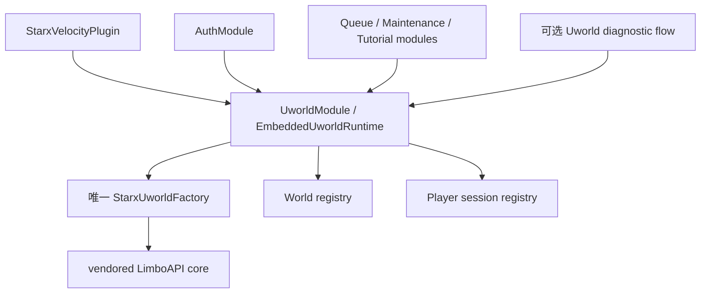
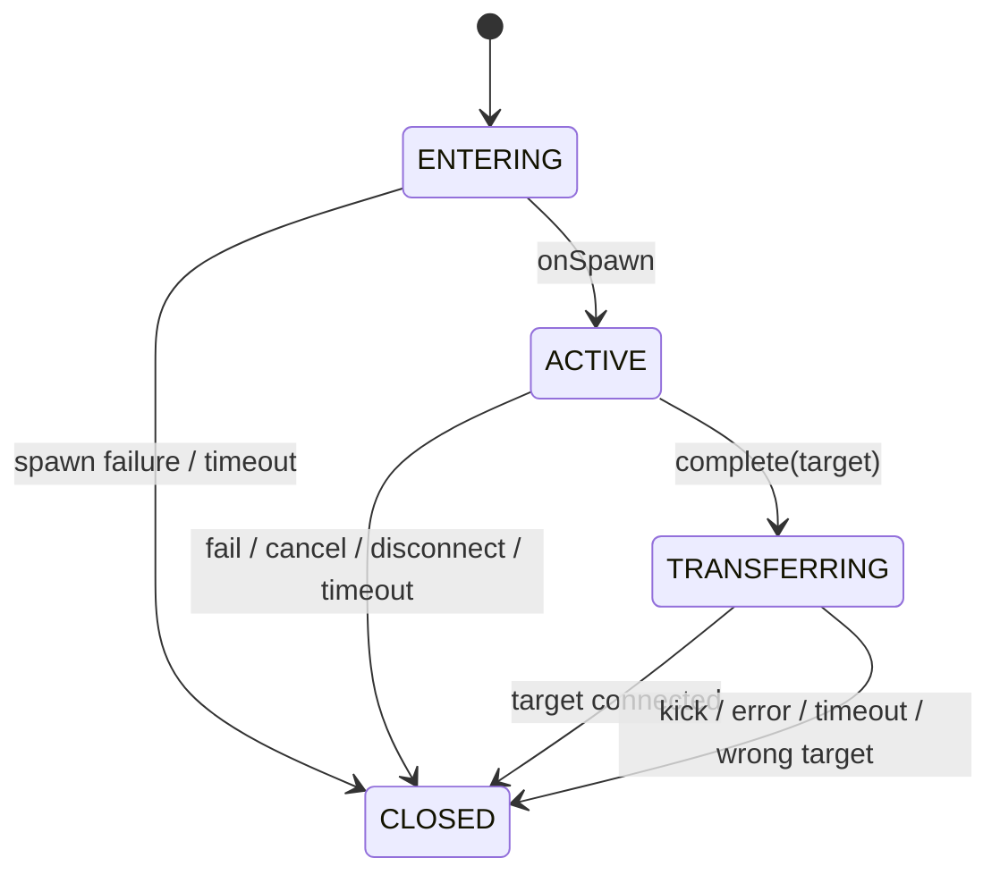
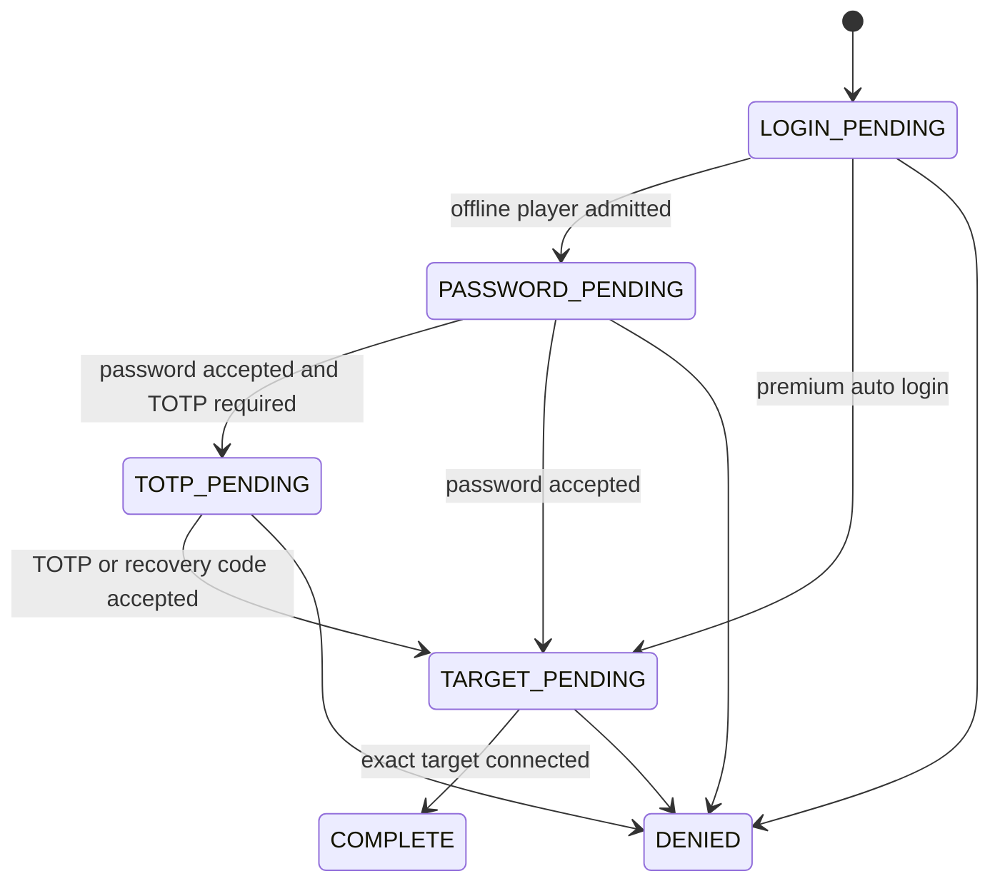

# Uworld 嵌入式虚拟世界运行时设计

状态：已确认（用户于 2026-07-14 确认）  
日期：2026-07-14

## 1. 目标

Uworld 是 StarX Velocity 主插件内置的通用虚拟世界运行时。它必须：

1. 由单个 `starx-velocity.jar` 自包含部署，不依赖外置 LimboAPI 插件。
2. 独立创建多个互相隔离的虚拟世界，并让玩家进入各自的流程。
3. 为认证、队列、维护、教程和诊断等模块提供统一的会话、超时、失败和转服语义。
4. 保证同一玩家只有一个受管 Uworld 会话，所有后端路由都绑定精确目标。
5. 修复当前认证代次、TOTP、路由和底层集合的并发安全问题。
6. 提供完整的开发、配置、部署、升级、故障处理和验收文档。

## 2. 非目标

本阶段不做以下事项：

- 不产出第二个可放入 Velocity `plugins/` 的 Uworld 插件 JAR。
- 不支持同时加载外置 LimboAPI 与内置 Uworld runtime。
- 不改写同步自 Elytrium LimboAPI 的底层协议类型、vendored 包名或许可证来源。
- 不承诺插件热重载。Uworld core 是进程级所有者，升级或重新启用必须重启代理。
- 不支持世界发布后的动态方块修改。世界必须先完整生成，再创建并发布虚拟服务器。

## 3. 命名和兼容策略

### 3.1 新名称

- 产品名称：`Uworld`
- 模块 id：`starx.uworld`
- 配置根：`uworld:`
- Java 产品包：`io.github.addxiaoyi.starx.uworld`
- Velocity 实现包：`io.github.addxiaoyi.starx.velocity.module.uworld`
- 核心入口：`StarxUworldFactory`
- 主模块：`UworldModule`
- 运行时接口：`UworldRuntime`

插件 id 继续为 `starx`，唯一部署物继续为 `starx-velocity.jar`。

### 3.2 保留名称

以下名称描述真实上游或底层兼容边界，不做产品化改名：

- Gradle 工程 `starx-limbo-api`
- Gradle 工程 `starx-standalone-limbo`
- vendored `io.github.addxiaoyi.starx.limbo.*` 实现包
- 底层 `Limbo`、`LimboFactory`、`LimboSessionHandler`、`LimboPlayer` 协议接口
- `sync-starx-limbo.ps1` 中的上游 artifact、源码路径和 override 名称

`StarxLimboFactory` 保留为一个大版本的弃用兼容入口；新代码只实例化 `StarxUworldFactory`。

### 3.3 配置迁移

新键优先级为：新键 > 旧键 > 默认值。

- `modules.starx.uworld.enabled` 兼容读取 `modules.starx.limbo.enabled`
- 旧扁平 `limbo:` 字段映射到新的 `uworld.auth`、`uworld.auth.world` 和 runtime 字段
- 两套键同时存在时使用新键，并输出一次迁移警告
- 旧键只兼容一个大版本，不会创建第二个模块实例

原 `LimboHubModule` 实际只提供 `/hub` 和 `/lobby` 命令，不属于虚拟世界运行时。它改名为 `HubCommandModule`，模块 id 保持 `starx.hub`。

## 4. 部署架构



`UworldModule` 在其他消费者之前启用。代理关闭采用两阶段生命周期：`ModuleManager.disableAll()` 先按启用顺序调用 `onShutdownStart()`，由 Uworld provider 拒绝新流程并以 `RUNTIME_STOPPING` 终止所有活跃 session；随后再按注册逆序调用 `onDisable()`，清理消费者入口和最终 provider 资源。保证顺序为：

1. Uworld runtime 进入 stopping，拒绝新流程。
2. 活跃玩家收到 `RUNTIME_STOPPING`，所有 `UworldHandle` 幂等关闭。
3. Diagnostics、Auth 等消费者逆序注销命令、监听器和业务状态。
4. Uworld provider 完成最终 listener/factory 引用清理。
5. 最后关闭数据库和代理级资源。

## 5. 公共 API

公共契约放在 `starx-limbo-api` 的 `io.github.addxiaoyi.starx.uworld` 包中，具体 Velocity 实现留在 `starx-velocity`。新增 Uworld 产品 API 使用 StarX 的 AGPL-3.0 许可证头；同一 artifact 中同步自上游的低层 API 继续保留 MIT 许可证头，NOTICE 必须逐项说明混合许可证边界。

### 5.1 UworldRuntime

职责：

- 创建受管世界。
- 查询运行状态。
- 仲裁玩家会话所有权。
- 集中处理断线、kick、目标服连接和超时。

概念接口：

```java
public interface UworldRuntime {
  boolean isReady();

  UworldHandle createWorld(
      String owner,
      UworldSpec spec,
      UworldWorldGenerator generator
  );

  Optional<UworldFlowSession> session(Player player);
}
```

公共接口不返回原始 `StarxUworldFactory`，避免消费者绕过世界、会话和关闭仲裁。

### 5.2 UworldSpec

不可变世界规格，包含：

- 唯一世界名称
- dimension
- spawn x/y/z/yaw/pitch
- game mode
- view distance
- simulation distance
- read timeout
- world time

构造时完成空值、范围和枚举校验。非法配置必须在世界发布前失败。

### 5.3 UworldWorldGenerator

生成器只在初始化阶段执行。`UworldWorldEditor` 提供：

- 创建方块并设置坐标
- 设置 biome
- 设置 block light 和 sky light
- 从 `SCHEMATIC`、`WORLDEDIT_SCHEM` 或 `STRUCTURE` 文件加载
- 生成默认 VOID 平台

生成器成功返回后，runtime 才调用底层 `createLimbo`。发布后的编辑器失效，避免 packet snapshot 与世界内容不一致。

### 5.4 UworldHandle

每个世界由 owner 持有一个幂等关闭句柄：

```java
public interface UworldHandle extends AutoCloseable {
  String name();
  boolean isOpen();
  UworldEnterResult enter(Player player, UworldFlowOptions options, UworldFlowHandler handler);
  CompletionStage<Void> closeAsync(Component reason);
}
```

`UworldEnterResult` 明确区分 `ACCEPTED`、`PLAYER_BUSY`、`WORLD_CLOSED`、`RUNTIME_STOPPING` 和 `SPAWN_REJECTED`，不得用 null 或日志代替失败结果。owner 重复注册相同世界名时抛出带 owner/world 上下文的 `UworldCreationException`。关闭世界会先终止该世界中的所有会话，再释放底层 packets。

### 5.5 UworldFlowSession

会话状态：



会话 API：

- `complete(RegisteredServer target)`：开始精确目标转服
- `fail(Component reason)`：内部失败并断开玩家
- `cancel(Component reason)`：业务取消
- `completion()`：返回唯一终态 `CompletionStage<UworldOutcome>`
- `execute(Runnable action)`：回到玩家连接 event loop
- `player()`、`world()`、`phase()`：只读上下文

所有终态操作必须幂等。`ServerConnectedEvent` 只有与保存目标完全匹配时才算完成。

### 5.6 UworldFlowHandler

回调覆盖：

- ready/spawn
- chat
- move/rotate/ground/teleport
- generic packet
- outcome

回调默认运行在玩家 Netty event loop，不得执行数据库、文件或网络阻塞操作。耗时工作必须 offload，回写通过 `session.execute` 返回连接线程。

## 6. 玩家和路由不变量

1. 同一个 `Player` 对象同一时刻只能属于一个 Uworld session。
2. 第二次 `enter` 不得静默替换 session handler，必须返回明确冲突错误。
3. `complete(target)` 后保留 session 到目标 `ServerConnectedEvent`。
4. `ServerPreConnectEvent(LAST)` 只允许 session 保存的目标，其他重定向和 fallback 一律拒绝。
5. wrong target、kick、connect future error、目标不存在和 15 秒转服超时都断开并清理。
6. `DisconnectEvent`、timeout 和 shutdown 可以并发发生，但只能产生一个 outcome。

## 7. 认证流程

认证不再用 `connections`、`pendingAuth`、`totpMode`、`routes` 四套可漂移状态。新增纯状态机 `AuthFlowIndex<P, S>`。

### 7.1 状态



### 7.2 UUID owner lease

- `UUID -> Player` 使用 `putIfAbsent` 原子认领。
- 同 UUID 第二连接在 `LoginEvent(FIRST)` 明确拒绝，不能覆盖第一连接状态。
- `remove(uuid, player)` 只能由 owner 自己释放。
- 迟到的旧 Disconnect 或旧 LoginEvent 不能影响新连接。

### 7.3 Velocity 事件顺序

1. `LoginEvent(FIRST)`：认领 owner，建立 flow，所有认证调用包在显式错误边界内。
2. `LoginEvent(LAST)`：如果最终结果被其他插件拒绝，将该连接 flow 标记为 denied；不得重写其他连接状态。
3. `PostLoginEvent`：只有 `PASSWORD_PENDING` 或 `TOTP_PENDING` 才进入认证 Uworld。
4. `PlayerChooseInitialServerEvent(LAST)`：premium flow 使用已绑定目标，但不删除 route barrier。
5. `ServerPreConnectEvent(LAST)`：读取最终 effective target；认证阶段全部拒绝，`TARGET_PENDING` 只允许绑定目标。
6. `ServerConnectedEvent`：精确目标匹配后才 COMPLETE。

### 7.4 TOTP

只有当前 flow 处于 `TOTP_PENDING` 才能调用 TOTP 或恢复码验证。`AuthCommandHandler` 不再根据 UUID 级 `SessionManager` 自动把新连接输入解释为 TOTP。断线重连必须重新完成密码步骤。

## 8. 并发和底层安全

`LimboAPI` 中的玩家集合、login queue、kick callback 和 next server 改为并发集合。复合操作同时修正：

- `contains + add` 改为单次原子 `add`
- `contains + get` 改为单次 `get`
- 需要消费的值使用原子 remove/take
- `onFirstJoin` 失败时回滚 player 标记

世界在发布前单线程构建，发布后视为不可变。玩家会话由不同 Netty event loop 并发运行，因此 runtime registry、关闭和 timeout 必须使用 CAS 或 `ConcurrentHashMap.compute*`。

## 9. 配置

新默认配置必须写出全部受支持字段：

```yaml
modules:
  starx.uworld:
    enabled: true

uworld:
  enabled: true
  transfer-timeout-seconds: 15
  auth:
    timeout-seconds: 300
    target-server: "lobby"
    world:
      dimension: "OVERWORLD"
      spawn-x: 0.5
      spawn-y: 100.0
      spawn-z: 0.5
      spawn-yaw: 0.0
      spawn-pitch: 0.0
      game-mode: "SURVIVAL"
      loader-type: "VOID"
      file-name: "auth_world.schem"
      offset-x: 0
      offset-y: 0
      offset-z: 0
      view-distance: 4
      simulation-distance: 4
      platform-radius: 5
  diagnostics:
    enabled: false
    timeout-seconds: 120
    platform-radius: 5
```

`platform-radius: 5` 明确生成 11x11 平台，取代语义含糊的 `platform-size`，后者作为旧别名读取。旧 `limbo` 扁平字段只迁移到认证世界，不成为所有 Uworld 的全局默认值。

`uworld.auth.target-server` 执行 trim；null 或 blank 归一化为 `lobby`。Auth 和 Uworld 只解析一次并共享同一个 `RegisteredServer`。

Uworld core 新路径为 `plugins/starx/uworld/core.yml`。如果新文件不存在但 `plugins/starx/limbo/core.yml` 存在，则读取旧路径并警告；不自动删除或覆盖旧文件。

## 10. 独立诊断流程

为证明 runtime 不依赖认证数据库，提供默认关闭的诊断流程：

- 配置：`uworld.diagnostics.enabled: true`
- 权限：`starx.uworld.diagnostics`
- 命令：`/uworld test`、`/uworld status`、`/uworld leave`
- `/uworld test` 生成或复用独立诊断世界，让执行者进入并接收聊天/移动回调
- `/uworld leave` 返回进入前的后端；没有前序后端时使用配置的 hub
- 超时、目标不可用或错误目标都按标准 Uworld outcome 处理

生产默认关闭 `test` 和 `leave` 入口。`status` 始终注册，但只允许拥有权限的管理员查看 runtime、world 和 session 数量。

## 11. 支持环境

| 项目 | 要求或状态 |
|---|---|
| Java | 21 |
| Velocity API/runtime | `3.5.0-SNAPSHOT`，当前冷启动证据为 build 606 |
| 最低 runtime protocol | 776；低于该值拒绝初始化 |
| 构建系统 | Gradle Wrapper 8.10 |
| 唯一插件文件 | `starx-velocity.jar` |
| 外置 LimboAPI | 禁止安装 |
| Windows 源码路径 | Gradle test worker 需 ASCII workspace/cache 映射，文档提供脚本 |
| Linux 生产部署 | Java 21 + Velocity 3.5；必须执行冷启动和客户端验收后上线 |
| 热重载 | 不支持，必须重启 Velocity |
| 后端要求 | 配置的 hub server 必须在 Velocity 注册且可连接 |

客户端版本兼容范围由 Velocity、mapping 资源和 `plugins/starx/uworld/core.yml` 的 prepare min/max 共同决定。未经过客户端矩阵验证的版本不宣称已支持。

## 12. 日志和失败语义

启动成功必须记录：

- Uworld core initialized
- 世界来源（VOID 或文件类型/文件名）
- 平台尺寸或已加载 chunk 数
- Uworld runtime ready
- 认证世界 ready

以下情况必须 fail closed，并给出玩家可读消息及带上下文的内部日志：

- Uworld 初始化失败
- 配置枚举或范围非法
- 世界文件解析失败
- 重复 owner 或世界名
- 同 UUID 并发登录
- 目标服务器不存在或连接失败
- wrong target、kick、timeout、shutdown

不得再记录“using lobby authentication”同时实际拒绝登录的矛盾日志。

## 13. 文档交付

必须新增或完善：

1. `starx-plugins/starx-velocity/README.md`：要求、构建、部署、首次启动、升级和回滚。
2. `starx-plugins/starx-standalone-limbo/README.md`：内嵌 runtime 定位、生命周期和底层 API 边界。
3. `docs/UWORLD_CONFIGURATION.md`：全部配置、旧键迁移、文件路径和 loader。
4. `docs/UWORLD_DEVELOPMENT.md`：公共 API、独立世界和流程示例、线程规则。
5. `docs/UWORLD_ACCEPTANCE.md`：自动门禁、冷启动和真实客户端矩阵。
6. `UPSTREAM.md`：上游 URL、固定提交、许可证、override 和同步升级检查表。
7. MIT 与 AGPL-3.0 许可证/NOTICE 文件，明确 StarX 修改和上游来源。

版本只保留一个权威来源：Gradle `project.version`。构建时将该值写入 `velocity-plugin.json`，不再维护第二个硬编码版本。

## 14. 测试和验收

### 14.1 自动测试

- Uworld session 的所有状态和幂等终态
- world owner、重复 world 和重复 player enter
- exact target、wrong target、redirect、kick、future error 和 timeout
- 同 UUID A/B 并发登录、迟到 Disconnect 和 owner 释放
- password/TOTP/recovery code 的连接代次绑定
- null/blank/trim hub 和新旧配置优先级
- world spec 边界、VOID 11x11 平台和三种文件 loader
- LimboAPI 并发集合和复合操作
- shutdown 顺序和活跃玩家关闭
- 旧 `starx.limbo` / `limbo:` 配置兼容

### 14.2 构建门禁

- `starx-standalone-limbo:test`
- `starx-velocity:test`
- `compileJava`
- `build`
- `shadowJar`
- 最终 JAR mapping、relocation、plugin id 和 Uworld class 检查
- 禁止外置 LimboAPI class、嵌套 LimboAPI JAR、任意首服 fallback 和旧生产模块 id

### 14.3 运行时门禁

- Velocity 3.5 build 606 冷启动
- 自动生成 `config.yml` 和 Uworld `core.yml`
- HTTP 服务响应
- Uworld、认证世界和诊断世界均 ready
- 进程退出后无端口或残留 Java 进程

### 14.4 真实客户端验收

- 离线新用户注册
- 已注册用户密码登录
- TOTP 6 位码和 10 位恢复码
- 正版自动认证
- 同 UUID 快速双连接不能绕过
- 默认 VOID 11x11 石台可见且玩家不下落
- diagnostics 流程进入、聊天、退出和返回原服
- pending 玩家不能访问任意后端
- 认证成功只进入 hub
- hub 不存在、kick、错误目标、连接异常和超时都断开清理
- 代理关闭时仍有 Uworld 玩家

## 15. 完成定义

只有满足以下全部条件才能标记完成：

1. Uworld 名称、API、配置、日志和文档一致，旧名称仅存在于明确的兼容层和上游说明。
2. 单一 runtime 能创建至少认证世界和诊断世界，并独立接入玩家流程。
3. Critical 并发登录绕过及所有已确认 Important 风险有回归测试。
4. 自动构建、JAR、CodeGraph 和冷启动门禁全部通过。
5. 文档包含可执行命令、完整配置、API 示例、故障语义和人工验收表。
6. 未执行的真实客户端项目必须明确标为未验证，不能用单元测试替代。
